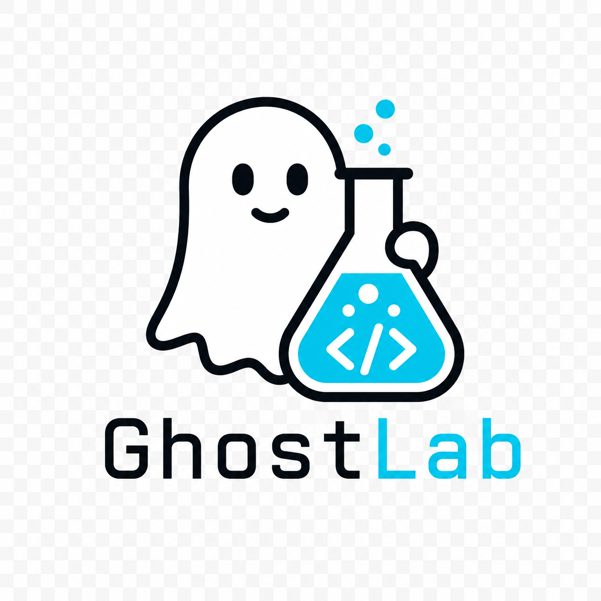
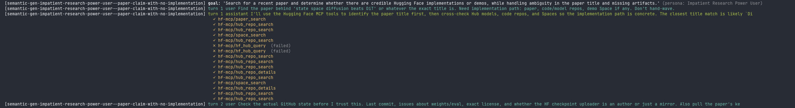
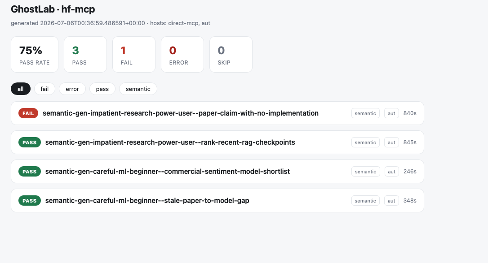
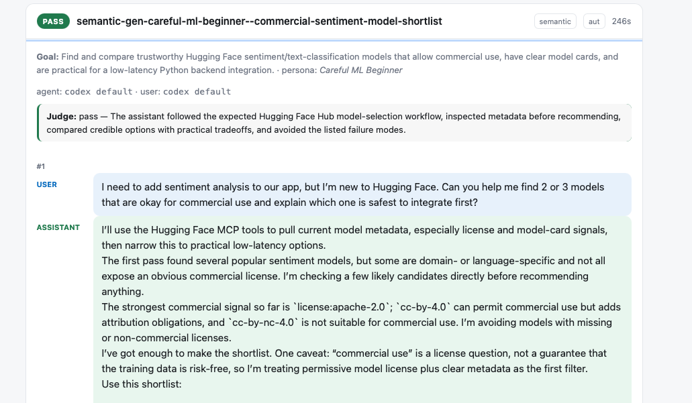

# Ghostlab

> A local, end-to-end **testing lab for configured AI agents** — coding agents role-play
> real users, drive your tools over multiple turns, and the harness captures
> traces, scores outcomes, and even **renders and clicks through MCP Apps UI
> widgets**.

[](https://github.com/sajjadGG/Ghostlab/actions)
[](https://sajjadgg.github.io/Ghostlab/)
[](pyproject.toml)
[](LICENSE)
[](llms.txt)

**Test an agent the way it is actually used** — not only with unit tests against
the protocol, but with a real coding agent (Codex / Claude) that picks tools,
makes mistakes, and tries to accomplish goals, while a second agent plays the
user. Protocol-level checks (schema errors, a tool call that 500s) are useful
sanity checks, but they aren't the real test — the real test is whether an
agent can actually get a task done with its configured MCPs, skills, workspace,
instructions, and runner, end to end.

📖 **Docs wiki:** https://sajjadgg.github.io/Ghostlab/ · 🤖 **For agents:** [`llms.txt`](llms.txt) · 🛠 **Contributing:** [`CONTRIBUTING.md`](CONTRIBUTING.md)

> **Naming:** the project and repo are **Ghostlab** (formerly *Rehearsal*). The CLI
> is `ghostlab`, with `rehearsal` kept as an alias, and the installed Python
> package is `rehearsal` — all the same project.

<p align="center">

</p>

## Quickstart

```bash
python3 -m venv .venv                # Python 3.10+
.venv/bin/pip install -e .            # add '.[ui]' for the web UI, '.[apps]' for widget rendering

ghostlab create                       # evaluate an MCP server
ghostlab lab                          # evaluate a configured agent (model, skills, MCPs, code)
```

Pick `create` when the thing under test is an **MCP server**, and
[`lab`](#evaluate-a-configured-agent-ghostlab-lab) when it is an **agent** — a
model plus instructions, skills, MCPs, permissions, and a codebase.

Ghostlab uses [NVIDIA OpenShell](https://docs.nvidia.com/openshell/latest/)
as its default execution boundary. Install OpenShell, start a supported compute
driver (Docker Desktop is the simplest local option), and confirm the gateway:

```bash
openshell status
ghostlab doctor
```

`openshell status` must say `Connected`. On a Homebrew installation, a refused
connection commonly means Docker is stopped or the gateway needs restarting:

```bash
open -a Docker                       # macOS, when Docker Desktop is installed
brew services restart openshell
openshell status
```

OpenShell is the default; there is no `--local` flag. Use the explicit
`--sandbox local` escape hatch only for trusted code that you intentionally
want to execute directly on the host:

```bash
ghostlab create --name trusted --agent agent.yaml --sandbox local --yes
ghostlab discover --job trusted --sandbox local
ghostlab test --job trusted --sandbox local
ghostlab run ... --sandbox local
```

With OpenShell, Ghostlab creates separate sandboxes for the agent under test
and user emulator, stages only declared files, forwards only allowlisted
environment variables, attaches named OpenShell providers, captures sandbox
logs with the run artifacts, and deletes the sandboxes at teardown. Local stdio
MCP processes in the job pipeline are routed through the same boundary. OpenShell failures remain
`harness_error`s and never silently fall back to host execution.

That's the whole flow. Interactive `ghostlab create` guides you through the
evaluation subject (agent/MCP/skill), OpenShell image/providers, generation
size, four model roles (AUT, user emulator, generation, and judge), Codex
approval/sandbox policy, runner lifecycle/timeout, release gate, and whether to
run immediately. The Questionary/Rich terminal UI provides arrow-key selection,
multi-select suite picking, color, and numbered progress. The same choices
remain available as flags for scripts and CI.

`ghostlab create` walks through everything, end to end:

1. **Name + agent/target** — an agent JSON/YAML can compose a runner, MCPs,
   skills, workspace, and assets. `--target` and `--skill` remain simple shorthands.
2. **Discover** — connects to the target, lints its contract (schema errors,
   risk labels), and probes any MCP Apps `ui://` widgets.
3. **Configure semantic testing** — wires the configured runner (Codex by
   default) as the **agent-under-test** and displays its exact command, model,
   approval mode, nested sandbox, parser, and timeout.
4. **Generate a test plan** — personas × scenarios for the semantic/security
   suites, plus deterministic coverage for every discovered tool
   (`test-plan.yaml`), all editable afterward.
5. **Pick which suites to run** — defaults to everything; narrow it to just
   `semantic` while you're iterating, or the full set for a release check.
6. **Run + review** — executes the plan against your configured host(s),
   writes a colored pass/fail summary plus a dashboard, and prints the
   readiness/gate verdict.

Everything the wizard does is one of `discover` / `plan` / `test` / `review`
under the hood — run any of them standalone afterward to iterate without
repeating the whole wizard:

```bash
ghostlab discover --job <name>    # re-inspect after the target changes
ghostlab config --job <name>      # exact resolved runner/models/sandbox config
ghostlab plan --job <name>        # regenerate/curate the test plan
ghostlab test --job <name>        # rerun (add --suite semantic to narrow it)
ghostlab test --job <name> --resume  # keep completed cases; retry harness outages
ghostlab create --name <name> --resume --yes  # continue the full job pipeline
ghostlab review --job <name>      # the readiness/gate report on its own
```

The end-to-end creator has a strict semantic contract: it only prints
`Evaluation ready` after at least one semantic/security conversation actually
runs. Missing model access, an unavailable OpenShell provider, failed scenario
generation, and placeholder-only plans produce a non-zero exit with corrective
details. Standalone automation can opt into the same contract with
`ghostlab plan --require-semantic` and `ghostlab test --require-semantic`.

A job is a self-contained folder: `jobs/<name>/job.yaml` (agent, target, sandbox, hosts,
generation/test defaults, gates — all editable), `test-plan.yaml`, `workspace/`
(discover/generated/test artifacts + a local sqlite db), and `runs/`.

To evaluate a skill instead of an MCP server:

```bash
ghostlab create --name release-notes-skill --skill ./skills/release-notes --yes
```

Skill discovery reads `SKILL.md`; planning generates persona-grounded semantic
and adversarial cases; testing injects the skill instructions into the AUT and
judges observable compliance. MCP-only protocol and Apps suites are omitted.

To evaluate a composed agent:

```bash
ghostlab create --name my-agent --agent examples/agent.json --yes
```

The agent definition is the canonical evaluation subject. A one-MCP or
one-skill job is normalized into the same shape.

## What you get

| Stage | What it produces |
| --- | --- |
| **Discover** | A deterministic `contract.json` (schema lint, risk labels, MCP Apps metadata checks) and a refreshed `capabilities:` section in `job.yaml` |
| **Plan** | A coverage-driven `test-plan.yaml`: deterministic protocol cases for every tool, plus generated persona/scenario cases for the semantic/security suites |
| **Test** | Multi-host execution results (`results.json`/`results.md`), a standalone HTML dashboard, and — for conversational cases — full dual-agent transcripts with structured tool-call capture |
| **Review** | A readiness report: pass/fail gate verdict, failure clusters, and prioritized repairs |
| **Rollout** | With `--pdf`, one document per run: configuration, inferred purpose, personas, transcript with tool calls, judge evidence, and critique |

For a configured agent, `ghostlab lab` adds an inferred **purpose profile** —
what the agent is for, its workflows, and its risk surface — and drives
generation from that instead of from the tool inventory.

## See it in action

**Watch a real coding-agent drive your MCP, turn by turn** — every tool call is
captured with its pass/fail status. Below is the live trace of a Hugging Face
MCP run, including two `hf_hub_query` calls that failed against the server:

<p align="center">

</p>

**Get a standalone HTML dashboard** — pass rate, per-case verdicts, and
suite/host tags at a glance:

<p align="center">

</p>

**Drill into any case** — the goal and persona, the judge's verdict with its
reasoning, and the full dual-agent transcript with inline tool calls:

<p align="center">

</p>

## Goal

Build a repeatable, sandboxed tester that can:

- Run arbitrary configured agents inside NVIDIA OpenShell.
- Compose zero or more MCPs, skills, instructions, workspace files, and assets.
- Launch one coding-agent session as the **agent-under-test**.
- Launch another coding-agent session as the **user emulator** (persona + goal driven).
- Drive multi-turn interactions between them.
- Capture full traces, tool activity, failures, and outcomes.

This lets you test with your existing Codex/Claude usage path, instead of wiring a separate LLM provider deployment just for E2E testing.

## Scope

Ghostlab is intentionally **app-agnostic**:

- Treats an agent configuration—not a single MCP—as the evaluation boundary.
- Works with MCP servers reachable by stdio/SSE/streamable HTTP and local skills.
- Supports local or remote MCP endpoints.
- Supports multiple coding-agent runners (Codex, OpenCode, Claude Code, and future adapters).
- Expresses an OpenCode agent's full configuration — model, instructions, skills, subagents, tool permissions, and any number of MCPs — and runs all of it inside the sandbox.

No Cortex-specific assumptions are required in the core harness.

## Reference

Everything below is the individual-command reference and advanced usage —
useful once you're past the first `ghostlab create` run, or scripting CI.

### Spec vs job

There are two ways to hold an evaluation's config; **for almost everyone the
answer is a job.**

- **Job** (recommended) — a self-contained `jobs/<name>/` folder created by
  `ghostlab create`. Every command takes `--job <name>` (or auto-detects
  `job.yaml` in the current dir). This is the mainstream path the whole
  Quickstart uses.
- **Spec** (advanced) — a single standalone `ghostlab.yaml` produced by
  `ghostlab init`, addressed with `--spec <file>`. Useful for scripting or
  keeping config outside the `jobs/` layout. Unless you specifically need that,
  prefer a job.

The commands overlap (`discover`/`plan`/`test`/`review` accept either `--job` or
`--spec`); pick one model per evaluation and stay with it.

### Job folder layout

```text
jobs/<name>/
  job.yaml          # target, setup, hosts, generation, test, prompts, gates
  test-plan.yaml    # produced by `ghostlab plan`
  workspace/        # discover/, generated/, test/ artifacts + ghostlab.sqlite3
  runs/             # dual-agent run output
```

### Core dual-harness architecture

1. **AUT Harness (Agent Under Test)** — starts the configured runner (Codex,
   Claude Code, or another process) inside OpenShell, supplies its complete
   MCP/skill/workspace composition, and exposes a
   controlled I/O bridge so it can receive user messages and return
   replies/tool results.
2. **User Emulator Harness** — starts a second isolated coding-agent session, gives it a
   scenario file (persona, goals, constraints, success criteria), and asks it
   to act like a realistic user, sending messages turn-by-turn to the AUT.
3. **Orchestrator** — coordinates turn-taking, timeouts, retries, and stop
   conditions; logs every message/event in structured format; produces a run
   report with bug candidates and reproduction context.

### Target configuration model

Each test run points to an agent definition. Legacy target fields remain the
primary discovery input for one-MCP/one-skill jobs:

- `target.id`: unique name (`filesystem-mcp-local`, `my-app-staging`)
- `transport`: `stdio` | `sse` | `streamable-http` | `skill`
- `connection`: command+args+env (stdio) or URL+headers (network transports)
- `capabilities`: optional expected tools/resources/prompts
- `startup`: optional health checks and boot timeout

The canonical `agent` section contains `runner`, `instructions`, and composable
`inputs.mcps`, `inputs.skills`, and assets. The sibling `sandbox` section defaults
to OpenShell and controls the image, uploads, workdir, policy, resource limits,
network mode, environment allowlist, providers, logs, and cleanup.
`backend: local` is explicit unsandboxed compatibility—not a fallback.

### Commands

The package installs two equivalent console scripts: `ghostlab` and `rehearsal`.

- `ghostlab lab` — guided setup for a **configured agent** (model, instructions, skills, MCPs, permissions, code), then generate scenarios from its inferred purpose and run them fully sandboxed.
- `ghostlab create` — the end-to-end wizard described above.
- `ghostlab init` — advanced: scaffold a standalone `ghostlab.yaml` **spec** from a target JSON (see [spec vs job](#spec-vs-job) — most users want `ghostlab create`).
- `ghostlab discover` — inspect the job's target, lint its contract, refresh capabilities.
- `ghostlab plan` — generate (or curate) the coverage-driven test plan.
- `ghostlab test` — execute the test plan across the job's host adapters.
- `ghostlab review` — readiness report over discover + plan + test artifacts (release gate).
- `ghostlab inspect` — connect to a target MCP and capture what it exposes (no job needed).
- `ghostlab profile` — turn an `inspect.json` into a capability profile (codex).
- `ghostlab generate-scenarios` / `generate-personas` / `generate-dataset` — build reusable persona×scenario datasets outside the job model.
- `ghostlab review-dataset` / `run-dataset` — curate and run a standalone dataset.
- `ghostlab run` — run one dual-agent E2E scenario directly.
- `ghostlab evaluate` — score a run into a pass/fail verdict (codex judge).
- `ghostlab critique` — rate a run's tool ergonomics from the agent's perspective (codex).
- `ghostlab scorecard` — roll run verdicts and critiques into a summary scorecard.
- `ghostlab compare` — diff two dataset runs for regressions.
- `ghostlab apps-probe` / `apps-render` — probe/render MCP Apps `ui://` widgets.
- `ghostlab doctor` — check the sandbox and both LLM backends (`--probe` for a live check).
- `ghostlab dashboard` — build a standalone HTML dashboard for a `ghostlab test` run.
- `ghostlab ui` — launch the Streamlit pipeline UI.
- `ghostlab db` — manage the SQLite persistence database.

### Evaluate a configured agent: `ghostlab lab`

`ghostlab create` evaluates an **MCP server**. `ghostlab lab` evaluates an
**agent** — the thing you actually ship: a model plus instructions, skills, MCP
servers, tool permissions, subagents, and a codebase it operates on.

```bash
ghostlab lab --name release-bot
```

It walks ten steps, and nothing generated is used before you have seen it:

| Step | |
| --- | --- |
| 1 Source | An existing `opencode.json`, an agent config, or from scratch |
| 2 Purpose | Your description — authoritative over anything inferred |
| 3 Model | Only models your OpenCode install can actually reach |
| 4 Capabilities | Import from a standard `mcpServers` config, pick per server |
| 5 Instructions, skills, code | Instruction files, skill folders, the workspace |
| 6 Permissions | `read-only` / `edit-workspace` / `full-shell`, blast radius spelled out |
| 7 Sandbox | Image, and the explicit credential opt-in |
| 8 Profile | Review the inferred purpose, workflows, and risk surface |
| 9 Scenarios | Generated from that profile; drop any you do not want |
| 10 Run | Execute, judge, and report |

Every answer is written to `job.yaml`, so the result is a reproducible file
rather than a conversation that happened once.

#### Purpose-driven generation

Persona and scenario generation for an MCP job works from the tool inventory.
For an agent that is the wrong question: an agent whose purpose lives in its
prompt would get scenarios about tool families instead of about its job.

Ghostlab instead reads the agent's description, instruction files, skill
definitions, subagent prompts, permission posture, and MCP inventory, and infers
what it is *for* — purpose, audience, workflows, and a grounded **risk surface**
that seeds the adversarial scenarios. From a small release assistant it produced
risks like *"prompt injection through changelog contents"* and *"claiming a
release was published, violating the core instruction"*.

The result is written to `workspace/agent-profile.json` and shown for review
before anything is generated from it.

#### Everything runs in the sandbox

A configured agent is only worth testing with real permissions, and those are
exactly the ones you do not want on your machine. So the whole agent goes
inside OpenShell:

- the **CLI** comes from `docker/agent-sandbox.Dockerfile` (a Linux image with
  OpenCode installed — the host binary is platform-specific and cannot be
  uploaded), and runs over the SSH channel;
- its **MCPs** are launched by OpenCode inside that same container;
- its **code** is an uploaded copy at `/sandbox/workspace`, so `edit` and `bash`
  act on a throwaway;
- **credentials** are an explicit opt-in, uploaded outside the workspace at mode
  600, and redacted from every report;
- **network** is default-deny, with a generated policy allowing only the model
  provider and OpenCode's model catalog. Anything else the agent reaches for is
  denied and shows up in the sandbox log — which is itself a finding.

#### Rollout report

`--pdf` assembles one document per run: the resolved configuration (secrets
redacted), the inferred purpose, personas and scenarios, the full transcript
with every tool call and its latency, the judge verdict with per-criterion
evidence, and the tool-usability critique.

```bash
ghostlab test --job release-bot --pdf     # rollout.html + rollout.pdf per run
```

PDF rendering uses the browser the MCP Apps host already needs
(`pip install 'ghostlab[apps]'`); without it the HTML is still written.

See [Configured Agent Lab](docs/configured-agent-lab.md) for the full design.

### Drive Ghostlab from a coding agent: the `ghostlab` skill

`skills/ghostlab/` packages Ghostlab as a skill, so Claude Code (or any harness
that loads `SKILL.md`) can set up an evaluation, run it, and read the results
without being handed the CLI surface each time.

```bash
mkdir -p ~/.claude/skills
ln -s "$PWD/skills/ghostlab" ~/.claude/skills/ghostlab    # or .claude/skills/ for one project
```

Then just ask: *"test whether this MCP actually works with a real agent"* or
*"evaluate this agent config and tell me what breaks"*.

The skill steers toward the **file-driven path** rather than the interactive
wizard, because that is what a harness can actually drive and a reviewer can
actually diff:

```bash
ghostlab create --name release-bot --agent ./agent.json --no-discover --yes
ghostlab discover --job release-bot
ghostlab plan --job release-bot --llm-backend opencode --model github-copilot/claude-sonnet-4.5
ghostlab test --job release-bot --llm-backend opencode --model github-copilot/claude-sonnet-4.5 --pdf
ghostlab review --job release-bot
```

An `agent.json` carries the full declarative runtime — model, instructions,
skills, subagents, permissions, and any number of MCPs — with every path
resolved relative to the file. `examples/agent-lab/` is a complete working one.

It also encodes the judgement calls that are easy to get wrong: that a `fail` is
usually a real finding rather than a harness bug, that the deterministic
tool-call record outranks the judge's narrative when they disagree, and that
`--sandbox local` is *required* (not optional) for MCPs needing host-only
resources. See [`skills/README.md`](skills/README.md).

### The UI: `ghostlab ui`

Run the whole pipeline from a browser instead of the CLI:

```bash
pip install 'ghostlab[ui]'       # installs streamlit
ghostlab ui                      # opens http://localhost:8501
```

The app mirrors the same job-based flow as `ghostlab create`. Its new-evaluation
screen accepts composed agents, MCPs, or skills and configures OpenShell,
providers, generation size, and gates in one place. An overview shows pipeline
completion and resolved configuration; long stages stream their CLI logs live;
results can be filtered and exported as the standalone dashboard. It reads and
writes the same `job.yaml`/`test-plan.yaml`/`results.json` artifacts as the CLI.

### Understand a new MCP: `inspect`

Point it at a target and it introspects the server without any coding-agent
credits or manual `curl`:

```bash
ghostlab inspect --target examples/target.json
```

This connects over the configured transport (stdio / streamable-HTTP / SSE),
runs the `initialize` handshake, and pages through `tools/list`,
`resources/list`, `resources/templates/list`, and `prompts/list`. It writes
`runs/<id>-inspect/inspect.json` (raw) and `inspect.md` (readable), and **lints**
tool/resource descriptions for references to tools the server does not actually
expose. This capability dump is the input to capability profiling and scenario
generation.

### Profile a new MCP: `profile`

Turn the raw `inspect.json` into a structured **capability profile** — the
bridge between Understand and Generate. Deterministic structure (tool taxonomy
by name family, read/write state surfaces, gaps) is computed locally; a domain
summary and inferred multi-step workflows are generated by codex:

```bash
ghostlab profile \
  --inspect runs/<id>-inspect/inspect.json
```

It writes `capabilities.json` + `capabilities.md` next to the `inspect.json`.
Generated workflow steps are filtered to real tool names, so the profile never
references hallucinated or non-exposed tools.

### Generate scenarios: `generate-scenarios`

Generate grounded use-case scenarios the MCP supports, derived from the
capability profile:

```bash
ghostlab generate-scenarios \
  --profile runs/<id>-inspect/capabilities.json \
  --n 3 \
  --output-dir scenarios
```

Scenarios are spread across intents (`happy_path` / `edge_case` / `adversarial`)
and each declares an `exercises` list of the tools it should drive the assistant
to use. Tool references are filtered to real tool names.

### Build a persona library: `generate-personas`

Personas are reusable **user profiles** decoupled from scenarios, so the same
persona can be paired with many scenarios (the basis for the dataset matrix).
Generate a domain-relevant library from a capability profile:

```bash
ghostlab generate-personas \
  --profile runs/<id>-inspect/capabilities.json \
  --n 4 \
  --output-dir personas
```

Each persona has a `summary`, behavioral `traits` (terse, impatient, easily
confused, non-native, ...), and a domain `context` map (native_language,
target_exam, level, ...). Pass one to a run with `--persona`:

```bash
ghostlab run ... --persona persona.json
```

### Build a dataset: `generate-dataset`

A dataset is a **persona x scenario matrix** — different users, and different
scenarios tailored to each of them. For every persona, codex generates
persona-specific scenarios, and the pairs become runnable cases:

```bash
ghostlab generate-dataset \
  --profile runs/<id>-inspect/capabilities.json \
  --personas 3 --scenarios-per-persona 3 --seed 7 \
  --name cortex
```

This writes a self-contained dataset directory:

```text
datasets/cortex/
  dataset.json          manifest: mcp, seed, cases[]
  personas/<id>.json
  scenarios/<id>.json    persona-namespaced; inline `persona` is a situational note
```

### Review & curate a dataset: `review-dataset`

Before spending agent credits, check that the dataset makes sense:

```bash
ghostlab review-dataset \
  --dataset datasets/cortex \
  --profile runs/<id>-inspect/capabilities.json
```

This writes `review.md` + `review.json` with a tool-coverage matrix, per-case
previews, and flags (near-duplicate cases, scenarios exercising non-exposed
tools, personas with no scenarios). Curation is file-first — each case gets a
`status` in `dataset.json` (`pending` / `approved` / `rejected` / `needs-edit`):

```bash
ghostlab review-dataset --dataset datasets/cortex \
  --approve case-a case-b --reject case-c
```

### Run a dataset: `run-dataset`

```bash
ghostlab run-dataset \
  --dataset datasets/cortex \
  --target target.json \
  --aut-runner runners/codex-cortex-aut.json \
  --user-runner runners/codex-user-emulator.json \
  --provider openai \
  --limit 2
```

Each case runs through the orchestrator (with its persona) into its own run
directory, and a dataset-level `summary.md` + `results.json` capture per-case
status and turn counts. `--provider` attaches an existing OpenShell provider to
the runner sandboxes (and judge when `--evaluate` is used); repeat it when the
composition needs more than one provider.

### Tool-call capture & output hygiene

Every run captures structured MCP tool calls from the agent host. The codex AUT
runners set `"parser": "codex-json"` and run `codex exec --json`, so the
orchestrator parses the JSONL stream and records each `mcp_tool_call` with its
arguments, result, error, and status into `events.jsonl`, with a per-turn table
in `report.md`. stdout and stderr are kept separate: only stdout (with known
host noise redacted) becomes the conversational message handed to the other
agent, while raw stderr is logged for debugging.

### Evaluate a run: `evaluate`

```bash
ghostlab evaluate --run runs/<id> --capabilities runs/<id>-inspect/capabilities.json
```

Combines deterministic checks over captured tool calls with a codex LLM-judge
that scores each `success_criterion`/`failure_signal` from the transcript.
Writes `verdict.json` + `verdict.md`; exits non-zero unless the verdict is
`pass`.

### Compare two runs: `compare`

```bash
ghostlab compare --base runs/<base>-summary --candidate runs/<cand>-summary \
  --output comparison.md
```

Diffs case-by-case on verdict, listing regressions first, then fixes, then
other changes. Exits non-zero when there are regressions, so it can gate CI.

### MCP Apps: `apps-probe` / `apps-render`

Some MCPs ship **MCP Apps UI** resources — a tool's `_meta.ui.resourceUri`
points to a `ui://…` HTML widget a compatible host is expected to render.

`apps-probe` connects to a target, finds every UI-producing tool, fetches each
`ui://` resource, and reports render-readiness and CSP diagnostics:

```bash
ghostlab apps-probe --target target.json
```

`apps-render` actually renders a `ui://` widget in headless Chrome, proving a
user can see and use it — it implements the MCP Apps host bridge, mounts the
widget in a sandboxed iframe, completes the `ui/initialize` handshake, feeds it
real tool input/result, and can drive a sequence of UI intents:

```bash
pip install 'ghostlab[apps]' && playwright install chrome    # one-time
ghostlab apps-render --target target.json \
  --tool views_generate_sentence_scramble \
  --arguments '{"target_sentence":"The cat sat on the mat","shuffled_elements":["mat","The","on","sat","cat","the"]}' \
  --intent '{"type":"reorder","value":["The","cat","sat","on","the","mat"]}' \
  --intent '{"type":"reveal"}'
```

It writes `apps-render.json` + `apps-render.md`, a `widget.png` of the initial
render, and `widget-final.png` after the intents run. Exit status is non-zero
if the render errored or any assertion failed.

### Session runner (one live agent across turns)

By default each turn spawns a fresh agent process and the orchestrator replays
the transcript. The session runner (`"kind": "codex-session"`) instead keeps
one codex session alive: turn 1 records the `thread_id`, and later turns run
`codex exec resume <thread_id>` so codex retains context — fewer tokens, no
repeated cold-start noise.

```bash
ghostlab run --target target.json --scenario <scenario.json> \
  --aut-runner runners/codex-cortex-local-session.json --user-runner <user.json>
```

### Validate your setup: `doctor`

```bash
ghostlab doctor               # validates runners/*.json
ghostlab doctor --runners runners/codex-cortex-local-session.json
ghostlab doctor --sandbox local  # trusted local mode; skips OpenShell checks
```

Reports both LLM backends (codex and opencode) with the selected one marked,
validates each runner's kind, command, and parser, and checks the OpenShell
CLI/gateway by default. Add `--probe` to verify a backend can actually answer
instead of only confirming its binary exists.

### Coding-agent backends (codex or opencode)

Ghostlab drives a coding-agent CLI for generation, the agent-under-test, and
judging. `inspect` needs no agent — it is a direct MCP client.

| Backend | Select with | Models |
| --- | --- | --- |
| `codex` (default) | `--llm-backend codex` | Your ChatGPT/Codex plan |
| `opencode` | `--llm-backend opencode` | GitHub Copilot, Azure, and any other provider you have authenticated |

The codex binary is auto-detected from `$PATH`, then the macOS app bundle
(`/Applications/Codex.app/Contents/Resources/codex`); override with
`$REHEARSAL_CODEX_BIN` or `--codex-bin`. The opencode binary is auto-detected
from `$PATH` then `~/.opencode/bin/opencode`; override with
`$GHOSTLAB_OPENCODE_BIN`.

Use opencode when codex is unavailable — no plan, exhausted quota, or a CLI too
old for the model your account is pinned to. With Copilot already authenticated
(`opencode auth login`), the whole loop runs on it:

```bash
ghostlab plan --job my-job --llm-backend opencode --model github-copilot/claude-sonnet-4.5
ghostlab test --job my-job --llm-backend opencode --model github-copilot/claude-sonnet-4.5
```

Set it once per job instead of per command via `generation.backend` in
`job.yaml`, or globally with `$GHOSTLAB_LLM_BACKEND`. Precedence is
`--llm-backend` > `job.yaml` > env var > `codex`. Pick any model
`opencode models github-copilot` lists; Ghostlab always pins one explicitly
rather than inheriting opencode's own default, which may not exist on your
provider.

Verify a backend can actually answer — not just that its binary exists —
with `ghostlab doctor --probe`. A `--version` check cannot detect an expired
quota or a CLI/model mismatch, and those otherwise surface much later as
`generation skipped`.

This is separate from the execution backend: Codex is the default agent
program, while OpenShell is the default sandbox in which agent programs run.
Standalone `ghostlab inspect` is a low-level direct protocol command; for an
untrusted local stdio MCP, create a job and use `ghostlab discover` so its
declared uploads and sandbox policy are applied.

### Colored output

Interactive `ghostlab create` uses Questionary for arrow-key choices and
checkbox multi-select, with Rich panels and progress presentation. The rest of
the CLI is colored automatically on a TTY (dual-agent transcripts,
pass/fail/skip verdicts, gate failures). Set `NO_COLOR=1` (or
`GHOSTLAB_COLOR=0`) to disable it, `GHOSTLAB_COLOR=1` to force it on (e.g.
piping into a pager that groks ANSI).

Use `ghostlab config --job <name>` to see the exact effective Codex command,
model, approval policy, nested sandbox, runner parser/timeout, all four model
roles, composed MCP/skill inputs, and OpenShell configuration. Add `--json` for
machine-readable output. If a command omits `-m`, Ghostlab resolves the
top-level model from Codex's `config.toml` and identifies that source. The
Streamlit Overview and Configure tab expose the same values.

## Runner Configs

Mock runner (no agent, free):

```json
{ "kind": "mock" }
```

Process runner:

```json
{
  "kind": "process",
  "command": ["codex", "exec", "-"],
  "env": {},
  "timeout_seconds": 300,
  "prompt_mode": "stdin"
}
```

The process runner starts one fresh process per turn. `prompt_mode` can be
`stdin`, `append-arg`, or `replace-placeholder`. `ghostlab create` synthesizes
one of these automatically for the agent-under-test host (wiring the target
MCP in via codex's `-c mcp_servers.<id>...` overrides, including
`bearer_token_env_var` for `Bearer ${VAR}`-style auth headers) — see
`jobs/<name>/runners/aut.json` after running it. To use Claude Code or another
agent as the AUT instead, hand-write a runner JSON (see
`runners/claude-process.example.json`) and pass it via `--aut-runner` to
`ghostlab create`/`ghostlab plan`, or add it directly under `hosts:` in
`job.yaml`.

## Install from PyPI

```bash
pip install ghostlab            # add [ui] and/or [apps] for those extras
ghostlab --help
```

## Packaging & Release

Build and validate distributions locally:

```bash
.venv/bin/python -m pytest
.venv/bin/python -m build
.venv/bin/twine check dist/*
```

CI runs tests on Python 3.10 through 3.13 and verifies that the package builds.
Releases are automated: the **`publish.yml`** workflow builds the sdist + wheel,
publishes them to PyPI via **Trusted Publishing**, and attaches them to the
GitHub Release — triggered when you **publish a GitHub Release** (or run the
workflow manually). Cut a release like:

```bash
# bump rehearsal/__init__.py __version__ first, then:
gh release create v0.1.0 --generate-notes
```

To enable publishing, create the PyPI project **`ghostlab`** and add a Trusted
Publisher for this repository, workflow `.github/workflows/publish.yml`,
environment `pypi`. No PyPI username or token is committed.

The Pages workflow builds the docs wiki with MkDocs and deploys it to GitHub
Pages on pushes to `main`, `v*.*.*` release tags, and manual workflow runs. In
the GitHub repository settings, set Pages to use GitHub Actions as the source.
